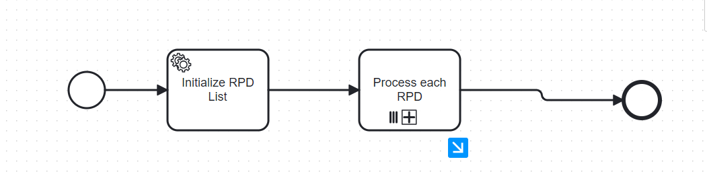
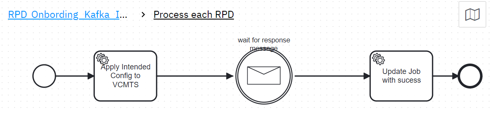

# Camunda Workflow with Multi-Instance Correlation of Kafka Responses

## Problem Statement

How can a Camunda workflow with a multi-instance task and multiple sub-service tasks reliably correlate Kafka responses to the correct instance of the originating sub-service task based on a composite ID?


Configure below entries in the NGINX Ingress under annotations

```nginx.ingress.kubernetes.io/affinity: cookie```  
```nginx.ingress.kubernetes.io/affinity-mode: persistent```

The property c```amunda.bpm.job-execution.enabled=true``` is used to enable the job executor in Camunda BPM. The job executor is responsible for executing background jobs, such as asynchronous continuations, timers, and other scheduled tasks. When this property is set to true, it ensures that the job executor is active and can process these jobs123.

The property ```camunda.bpm.job-execution.deployment-aware=true ```makes the job executor deployment-aware. This means that the job executor will only execute jobs for the process definitions that are deployed on the same node. This is particularly useful in a clustered environment, where you have multiple nodes running the Camunda engine. By setting this property to true, you ensure that each node only processes jobs for the deployments it is aware of, which helps in balancing the load and avoiding conflicts

To ensure that your BPMN file is deployed on both pods running the Camunda embedded Spring Boot application on EKS with a single PostgreSQL database, you can follow these steps:

1. **Auto-Deployment on Application Startup**: Configure your Spring Boot application to automatically deploy BPMN files on startup. Place your BPMN files in the src/main/resources/bpmn directory and use the @EnableProcessApplication annotation in your Spring Boot application class. This will ensure that the BPMN files are deployed whenever the application starts on any pod.

2. **Database Synchronization**: Since both pods are connected to a single PostgreSQL database, any deployment made by one pod will be reflected in the database and accessible by the other pod. This ensures that the BPMN files are synchronized across both pods.

3. **Deployment-Aware Job Execution**: Ensure that the camunda.bpm.job-execution.deployment-aware=true property is set. This makes the job executor deployment-aware, meaning each pod will only execute jobs for the process definitions it is aware of.

4. **Manual Deployment via REST API**: You can also deploy BPMN files manually using the Camunda REST API. This can be done by sending a POST request to the /deployment/create endpoint with the BPMN file. This approach ensures that the deployment is explicitly triggered and can be done from any pod.

5. **Cluster Configuration**: Ensure that your EKS cluster is properly configured to handle the deployment and execution of BPMN files across multiple pods. This includes setting up appropriate load balancing and ensuring that the pods can communicate with the PostgreSQL database efficiently


In your scenario, where you have two pods running a Camunda embedded Spring Boot application on EKS with a single PostgreSQL database, and a workflow instance is started by the first pod and is waiting at an Intermediate Message Catch Event, the message correlation will work seamlessly across both pods. Here's how it works:

1. **Shared Database**: Since both pods are connected to the same PostgreSQL database, they share the same state and data. This means that any changes or updates made by one pod are immediately visible to the other pod.

2. **Message Correlation**: When the message is received via the REST endpoint in the second pod, the correlation code will execute and look for the waiting execution in the shared database. The Camunda engine will find the execution that is waiting for the message, regardless of which pod it is running on.

3. **Execution Continuation**: Once the message is correlated, the Camunda engine will continue the execution of the workflow instance from the Intermediate Message Catch Event. This continuation will happen in the pod where the workflow instance is currently running, which in this case is the first pod.

4. **Cluster Configuration**: Camunda is designed to work in a clustered environment, and it handles message correlation and execution continuation across multiple nodes (pods) efficiently. The job executor and message correlation mechanisms are built to ensure that the workflow instances are processed correctly, even in a distributed setup.
5. 
Design and implement a Camunda workflow with a multi-instance task containing several sub-service tasks. One sub-service task publishes messages to a Kafka topic, including a composite ID (e.g., `wf_ID_sub_task_ID_12345`) derived from the workflow instance ID. The challenge is to efficiently and accurately route responses received from a separate Kafka topic back to the corresponding instance of the originating sub-service task, ensuring correct processing by a subsequent sub-service task.

### More Detailed

Design and implement a Camunda workflow with a multi-instance task containing several sub-service tasks. One sub-service task publishes messages to a Kafka topic, including a composite ID (e.g., `wf_ID_sub_task_ID_12345`) derived from the workflow instance ID. The challenge is to efficiently and accurately route responses received from a separate Kafka topic back to the corresponding instance of the originating sub-service task, ensuring correct processing by a subsequent sub-service task.





#### 1. Design the Workflow Model

- **Multi-Instance Task**: Create a multi-instance task in Camunda that will handle multiple sub-service tasks.
- **Sub-Service Tasks**: Define the sub-service tasks within the multi-instance task. Each sub-service task will publish a message to a Kafka topic.

#### 2. Generate Composite ID

- **Composite ID Structure**: Define a composite ID structure, e.g., `wf_ID_sub_task_ID_12345`, where `wf_ID` is the workflow instance ID and `sub_task_ID` is the sub-service task ID.
- **Assign Composite ID**: Assign this composite ID to each message published to the Kafka topic by the sub-service tasks.

#### 3. Publish Messages to Kafka

- **Kafka Producer**: Implement a Kafka producer in each sub-service task to publish messages to a Kafka topic. Include the composite ID in the message payload.

#### 4. Set Up Kafka Consumer

- **Kafka Consumer**: Implement a Kafka consumer that listens to the response topic.
- **Message Parsing**: Parse the incoming messages to extract the composite ID.

#### 5. Correlate Responses

- **Correlation Logic**: Implement logic to correlate the responses based on the composite ID. This can be done using Camunda’s message correlation feature.
- **Message Correlation**: Use the composite ID to correlate the response message to the correct instance of the originating sub-service task.

#### 6. Process the Correlated Message

- **Subsequent Sub-Service Task**: Once the message is correlated, ensure it is processed by the subsequent sub-service task in the workflow.

## Implementation Details

### 1. Camunda Workflow Configuration

- Define the multi-instance task and sub-service tasks in the BPMN model.
- Configure the message correlation in the BPMN model using the composite ID.

### 2. Kafka Producer Implementation

- Use a Kafka client library (e.g., Apache Kafka, Spring Kafka) to implement the producer.
- Ensure the composite ID is included in the message payload.

```java
ProducerRecord<String, String> record = new ProducerRecord<>("topicName", compositeID, messagePayload);
producer.send(record);
```

### 3. Kafka Consumer Implementation

- Use a Kafka client library to implement the consumer.
- Extract the composite ID from the incoming messages.

### 4. Message Correlation in Camunda

- Use Camunda’s Java API or BPMN model to correlate messages based on the composite ID.

### Example Code

#### Java

```java
runtimeService.createMessageCorrelation(compositeID)
        .processInstanceVariableEquals("compositeID", compositeID)
        .setVariable("correlatedPayload", msg.getPayload())
        .correlate();
```
When scaling up a Camunda Spring Boot application, managing sessions becomes crucial to ensure that user sessions are consistent and persistent across multiple instances. Here’s a detailed explanation of how session management works and how to configure it for a scalable Camunda application:

### Session Management in a Scalable Environment
#### Session Persistence:

In a single-instance setup, sessions are stored in the memory of the application server.
In a multi-instance setup, sessions need to be shared across instances to ensure that a user can continue their session regardless of which instance handles their request.
#### Using Redis for Session Management:

Redis is an in-memory data structure store that can be used to store session data.
Spring Session provides support for managing HTTP session state using Redis, which allows sessions to be shared across multiple instances.

## Problem Statement
You have a Camunda Spring Boot application that connects to a PostgreSQL database and is deployed on Kubernetes. When scaling the application to multiple replicas, you encountered an issue where accessing the Camunda Cockpit resulted in a 401 Unauthorized error. The error was observed in the browser console as:

```
http://localhost:8080/camunda/api/engine/engine/default/case-definition/count?latestVersion=true 401 (Unauthorized)
```

### Solution
The issue was resolved by introducing Redis for session management to handle the state across multiple replicas. The following steps were taken:

1. Added Dependencies:

* spring-session-data-redis
* spring-boot-starter-data-redis

2. Configured application.yaml:

* Set up Redis as the session store.
* Enabled Camunda authorization.

3. Updated Kubernetes Deployment:

* Configured the deployment and service for the Spring Boot application.
* Deployed Redis and configured it as a service.
* Enabled session affinity in the service configuration to ensure sticky sessions.

Relevant Configuration Excerpt
From kubernetes.yaml:

Dependencies
Spring Session Data Redis: This dependency provides support for managing HTTP session state using Redis.

```
<dependency>
    <groupId>org.springframework.session</groupId>
    <artifactId>spring-session-data-redis</artifactId>
</dependency>
```

Documentation: Spring Session Data Redis

Spring Boot Starter Data Redis: This dependency provides auto-configuration for Redis, including connection settings and RedisTemplate.
```
<dependency>
    <groupId>org.springframework.boot</groupId>
    <artifactId>spring-boot-starter-data-redis</artifactId>
</dependency>
```

Documentation: Spring Boot Redis

### Configuration
#### application.yaml: This configuration file sets up Redis as the session store and enables Camunda authorization.
```
spring:
  redis:
    host: redis
    port: 6379
  session:
    store-type: redis
camunda:
  bpm:
    webapp:
      index-redirect-enabled: true
    authorization:
      enabled: true
```
Documentation: Spring Session Configuration

Kubernetes Deployment: This configuration sets up the deployment and service for your Spring Boot application and Redis.

```
apiVersion: apps/v1
kind: Deployment
metadata:
  name: spring-app
spec:
  replicas: 2
  selector:
    matchLabels:
      app: spring-app
  template:
    metadata:
      labels:
        app: spring-app
    spec:
      containers:
      - name: spring-app
        image: your-docker-image
        ports:
        - containerPort: 8080
        env:
        - name: CAMUNDA_BPM_ADMIN_USER
          value: test
        - name: CAMUNDA_BPM_ADMIN_PASSWORD
          value: test123
---
apiVersion: v1
kind: Service
metadata:
  name: spring-app
spec:
  type: LoadBalancer
  selector:
    app: spring-app
  ports:
  - port: 8080
    targetPort: 8080
  sessionAffinity: ClientIP
---
apiVersion: apps/v1
kind: Deployment
metadata:
  name: redis
spec:
  replicas: 1
  selector:
    matchLabels:
      app: redis
  template:
    metadata:
      labels:
        app: redis
    spec:
      containers:
      - name: redis
        image: redis:latest
        ports:
        - containerPort: 6379
---
apiVersion: v1
kind: Service
metadata:
  name: redis
spec:
  ports:
  - port: 6379
  selector:
    app: redis
```
### Benefits of Using Redis for Session Management
* Scalability: Sessions are stored in Redis, allowing multiple instances to access the same session data.
* Persistence: Redis ensures that session data is persistent and not lost when an instance is restarted.
* Performance: Redis is an in-memory data store, providing fast access to session data.

### Summary
By configuring Redis for session management and ensuring that your Kubernetes deployment is set up correctly, you can scale your Camunda Spring Boot application while maintaining consistent and persistent user sessions across multiple instances. This setup helps avoid issues like 401 Unauthorized errors when accessing the Camunda Cockpit in a multi-instance environment.

index-redirect-enabled

